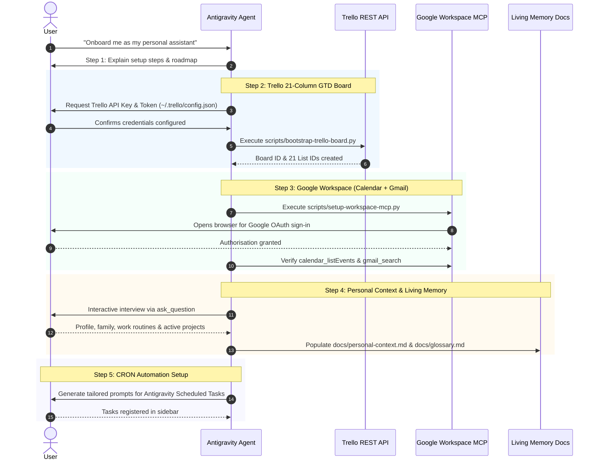

# Assistant Onboarding Wizard

This skill orchestrates a guided, step-by-step onboarding journey for new users configuring their personal assistant in Antigravity.

---

## The 5-Step Guided Onboarding Flow



---

## Detailed Execution Protocol

### Step 1: Welcome & System Verification
1. Welcome the user warmly and outline the modules being configured:
   - **Trello**: 21-column GTD rolling calendar engine.
   - **Google Workspace MCP**: Calendar commitments and VIP email triage.
   - **Google Tasks & Assistant (Optional)**: Voice capture on smartphones and smart speakers with automated Trello sync.
   - **Living Memory**: Your personal operational profile and glossary.
   - **Scheduled Tasks**: 07:00 Morning Standup, 20:30 Evening Reconcile, and Sunday Weekly Review.
2. Verify Python 3 and Node.js are available on the user's system.

### Step 2: Trello GTD Board Bootstrapping
1. Guide the user to obtain their Trello API credentials:
   - Navigate to [https://trello.com/app-key](https://trello.com/app-key).
   - Copy their **API Key**.
   - Click the link on that page to generate a personal **Token**.
2. Explain how to store them in `~/.trello/config.json`:
   ```json
   {
     "key": "YOUR_TRELLO_API_KEY",
     "token": "YOUR_TRELLO_API_TOKEN"
   }
   ```
3. Once the user confirms credentials are in place, run the bootstrapper:
   ```bash
   python scripts/bootstrap-trello-board.py --name "Personal2Weeks"
   ```
4. Confirm the board has been created with all 21 columns and default context labels.

### Step 3: Google Workspace MCP Setup
1. Run the workspace MCP installer script:
   ```bash
   python scripts/setup-workspace-mcp.py
   ```
2. The script will clone the upstream repository, install dependencies, compile the TypeScript code, generate `.agents/plugins/google-workspace/mcp_config.json`, and initiate the OAuth login flow in the browser.
3. Once the user completes sign-in, run a test tool call (e.g. `google_workspace:calendar_listEvents`) to verify active connection.

### Step 3b (Optional): Google Tasks & Google Assistant Voice Capture
1. Ask the user if they wish to configure voice task capture via Google Assistant.
2. If yes, guide them through the free 3-minute GCP desktop setup in `docs/google-tasks.md`:
   - Download their OAuth Desktop Client credentials JSON to `~/.google-tasks/client_secret.json`.
   - Run `node .agents/skills/google-tasks/scripts/tasks.mjs auth` to log in via local loopback.
   - Verify connection with `node .agents/skills/google-tasks/scripts/tasks.mjs status`.

### Step 4: Interactive Personal Context Interview
Conduct a structured interview using the `ask_question` tool to gather the user's operational reality. Do NOT ask all questions at once; walk through them step-by-step:

1. **Executive / Career Phase**:
   - What is your current role, company, and primary work location?
   - What is your working rhythm (full remote, hybrid in-office days)?
2. **Family & Household Routines**:
   - Partner/spouse details and shared calendar logistics?
   - Children/dependents: schools, drop-off and collection days/times, recurring clubs/tutoring?
   - Household staff or regular services (cleaner, gardener, dog walker)?
3. **Key Ventures & Active Focus**:
   - What are your top 2–3 active software ventures, creative projects, or home initiatives?
4. **Health, Wellness & Recreation**:
   - Fitness routines or training goals?
   - Hobbies, gaming, or recurring social commitments?

**Action**: Write their confirmed answers directly into `docs/personal-context.md` and populate initial entity definitions in `docs/glossary.md`.

### Step 5: Scheduled Tasks Registration
1. Explain how to access Antigravity's **Scheduled Tasks** in the left sidebar.
2. Present the user with their three personalised prompts:
   - **07:00 Morning Standup** (`0 7 * * *`)
   - **20:30 Evening Reconcile** (`30 20 * * *`)
   - **20:00 Sunday GTD Weekly Review** (`0 20 * * 0`)
3. Guide the user through saving each task.
4. Conclude with a celebratory completion summary and invite the user to ask for their first daily briefing!
