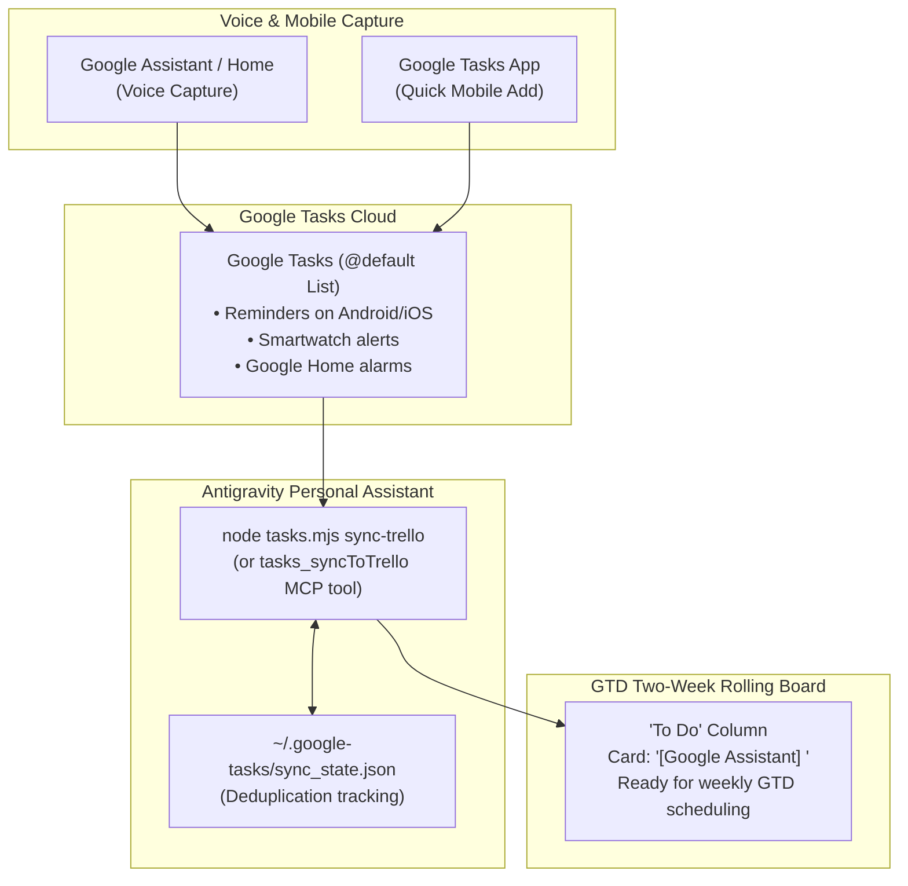

# Google Tasks Skill & Voice Capture Engine

This skill manages your Google Tasks integration and synchronises on-the-go tasks captured via **Google Assistant** (smartphones and Google Home speakers) directly into your Getting Things Done (GTD) Two-Week Rolling Trello board.

Powered by a lightweight Node.js ESM engine, it uses a dedicated local OAuth 2.0 desktop loopback client with **guaranteed £0.00 cloud hosting costs**.

---

## 1. Operating Architecture & Sync Philosophy

Tasks captured via voice or quick mobile prompts flow seamlessly into the GTD execution pipeline:



### Key Operating Conventions
1. **One-Way Synchronisation**: Tasks captured in Google Tasks are imported onto the `To Do` list of your GTD rolling board.
2. **Dual-Presence Persistence**: Tasks are **not deleted** from Google Tasks upon import. This ensures Google Calendar reminders, smartphone notifications, and Google Home audible alarms remain fully functional.
3. **Deduplication State**: Synced task IDs are recorded in `~/.google-tasks/sync_state.json` to prevent duplicate Trello cards across recurring review sessions.
4. **Dynamic Target Discovery**: Target list ID is resolved automatically from `~/.trello/gtd_board_config.json` (created by `bootstrap-trello-board.py`), `process.env.TRELLO_TODO_LIST_ID`, or explicit CLI/MCP parameter.

---

## 2. Free GCP Setup & Credential Isolation (£0.00 Guaranteed)

No billing account is required. The Google Tasks API (`tasks.googleapis.com`) is completely free to query (up to 50,000 queries per day):

1. **Create a Free GCP Project**: Open [Google Cloud Console](https://console.cloud.google.com/) and create a project (e.g. `personal-assistant-tasks`).
2. **Enable API**: Enable the **Google Tasks API** under *APIs & Services > Library*.
3. **OAuth Consent Screen**:
   - User Type: **External**
   - App Name: `Antigravity Tasks`
   - Scopes: `https://www.googleapis.com/auth/tasks`
   - Test Users: Add your personal Google email address.
4. **Create Credentials**:
   - Go to *Credentials > Create Credentials > OAuth client ID*.
   - Application Type: **Desktop app**.
   - Name: `Antigravity Desktop Client`.
5. **Save Credentials**: Download the JSON credentials and place them at:
   - `~/.google-tasks/client_secret.json`
6. **Authorise**:
   Run:
   ```powershell
   node .agents/skills/google-tasks/scripts/tasks.mjs auth
   ```
   This launches a local loopback server (`localhost:8085`), opens your browser, and saves the tokens to `~/.google-tasks/token.json`.

---

## 3. CLI Command Reference

Execute commands from the repository root:

### Authentication & Health
```powershell
# Initialise local OAuth loopback authentication
node .agents/skills/google-tasks/scripts/tasks.mjs auth

# Inspect credentials and token expiry status
node .agents/skills/google-tasks/scripts/tasks.mjs status
```

### Task Operations
```powershell
# List all task lists
node .agents/skills/google-tasks/scripts/tasks.mjs lists

# List active tasks in the primary list
node .agents/skills/google-tasks/scripts/tasks.mjs list

# Add a task with due date and notes
node .agents/skills/google-tasks/scripts/tasks.mjs add --title "Schedule dental checkup" --due 2026-09-15 --notes "Call local clinic"

# Complete a task
node .agents/skills/google-tasks/scripts/tasks.mjs complete <task_id>

# Delete a task
node .agents/skills/google-tasks/scripts/tasks.mjs delete <task_id>
```

### Trello One-Way Sync
```powershell
# Dry run preview of incoming Google Tasks
node .agents/skills/google-tasks/scripts/tasks.mjs sync-trello --dry-run

# Execute one-way synchronisation into Trello 'To Do'
node .agents/skills/google-tasks/scripts/tasks.mjs sync-trello
```

---

## 4. MCP Tools Reference

When running within Antigravity, the `google_tasks` MCP plugin exposes:
- `tasks_listLists`: Returns array of user task lists.
- `tasks_list`: Returns array of active tasks (`listId`, `showCompleted`).
- `tasks_create`: Creates a new task (`title`, `notes`, `due`, `listId`).
- `tasks_complete`: Marks a task completed (`taskId`, `listId`).
- `tasks_delete`: Deletes a task (`taskId`, `listId`).
- `tasks_syncToTrello`: Executes one-way sync into Trello (`targetListId`, `dryRun`).
