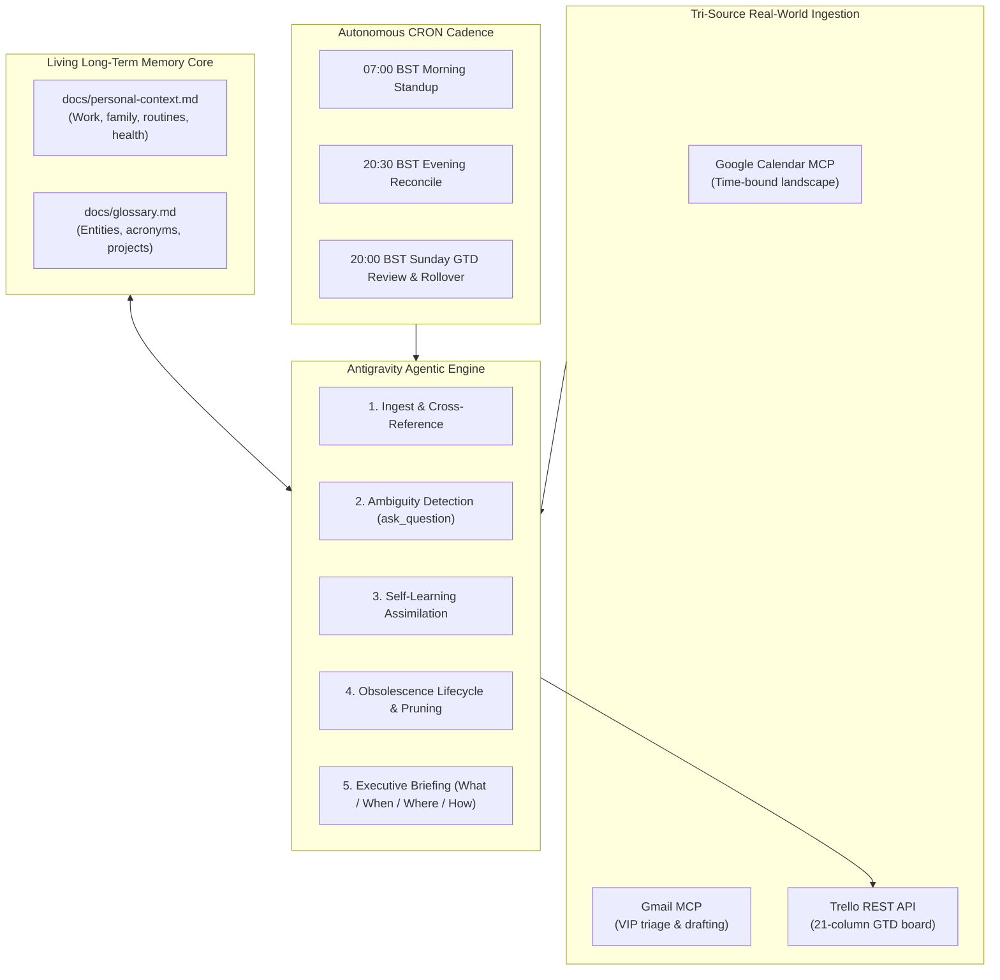
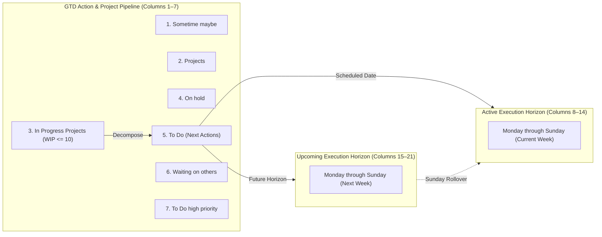

# 🤖 Antigravity Personal Assistant

[](LICENSE)
[](https://deepmind.google/technologies/gemini/)
[](https://modelcontextprotocol.io/)
[](docs/gtd-board-system.md)
[](https://python.org)

> **An autonomous, agentic executive assistant built for [Google Antigravity](https://deepmind.google/technologies/gemini/).**  
> Synthesises David Allen’s **Getting Things Done (GTD)** with a **two-week rolling execution horizon**, **Google Calendar**, **Gmail**, and a **self-learning living memory engine**.

---

## 🌟 Executive Overview

Most AI productivity tools either require constant micromanagement or drift out of date after a single day. 

The **Antigravity Personal Assistant** is designed from the ground up as a continuous, proactive pairing partner. Running locally on your machine, it ingests commitments from your calendar and inbox, maintains a 21-column visual task lifecycle board on Trello, grounds decisions in living long-term memory documents, and executes autonomous morning and evening routines on a CRON schedule.



---

## 🚀 Quickstart: 5-Minute Setup with Your AI Agent

You don’t need to spend hours configuring API endpoints or writing JSON schemas. **Let your Antigravity agent do the entire setup for you!**

### Step 1: Clone the Repository
```bash
git clone https://github.com/s0ck3t/antigravity-personal-assistant.git
cd antigravity-personal-assistant
```

### Step 2: Open in Antigravity
Launch the **Antigravity Desktop App** and open this repository workspace (`File -> Open Folder`).

### Step 3: Prompt Your Agent
In the Antigravity chat window, paste this single prompt:

```text
Hey Antigravity, onboard me as my personal assistant.
```

Your agent will launch the **`assistant-onboarding`** wizard and interactively:
1. 📋 Guide you to obtain free [Trello API keys](https://trello.com/app-key) and automatically run `scripts/bootstrap-trello-board.py` to create your 21-column board.
2. 📧 Run `scripts/setup-workspace-mcp.py` to install and connect Google Calendar and Gmail via OAuth.
3. 🧠 Conduct a brief, friendly interview (`ask_question`) to learn your role, family schedules, and active projects, populating your personal living memory.
4. ⏰ Tailor and guide you through registering your 3 Scheduled Tasks in the Antigravity sidebar!

---

## 📋 The 21-Column GTD Rolling Calendar Engine

Rather than an endless vertical backlog where old tasks go to die, this framework implements an operational **21-column visual lifecycle**:



### Why This Architecture Works
* **WIP-Limited Focus**: `In Progress Projects` enforces a strict WIP limit (maximum 10 active projects) to eliminate fragmentation.
* **Rolling Horizon**: Week 1 is always the active 7 days. Every Sunday evening, the assistant bulk archives completed tasks, rolls forward Week 2 into Week 1, and replenishes Week 2 from your upcoming Google Calendar commitments.
* **Context Over Colour**: Cards use self-contained prefix semantics (`[Home]`, `[Call]`, `[Online]`, `[Finance]`) and time markers (`10:30am Dentist`), ensuring optimal clarity on both mobile and desktop.

*Full specification and workflow rules*: [docs/gtd-board-system.md](docs/gtd-board-system.md).

---

## 📧 Google Workspace Integration (Calendar & Gmail)

The assistant connects to Google Workspace via the **Model Context Protocol (MCP)** using `gemini-cli-extensions/workspace`.

* **Google Calendar**: Tracks time-bound landscape appointments, detects scheduling conflicts, and schedules prep time.
* **Gmail**: Scans unread correspondence from VIP senders (employers, schools, doctors, family) and drafts outgoing replies for review.
* **Local Security**: Refresh tokens are stored directly in your operating system's native keychain (Windows Credential Manager, macOS Keychain, Linux Secret Service via `keytar`).
* **Safety Switches**: Destructive tools (`gmail.send:off`, `calendar.deleteEvent:off`) are locked down by default to prevent unintended actions.

*Step-by-step setup guide*: [docs/google-workspace-setup.md](docs/google-workspace-setup.md).

---

## 🧠 Living Long-Term Memory System

The assistant maintains two canonical, human-readable Markdown files that serve as its long-term grounding:

1. **[docs/personal-context.md](docs/personal-context.md)**: Operating profile detailing executive work patterns, hybrid working arrangements, family schedules, school run routines, household services, and fitness goals.  
   *(Clean scaffold: [docs/personal-context.template.md](docs/personal-context.template.md))*
2. **[docs/glossary.md](docs/glossary.md)**: Cross-referenced directory of corporate entities, schools, clubs, software ventures, legal acronyms, and hobbies.  
   *(Clean scaffold: [docs/glossary.template.md](docs/glossary.template.md))*

### Continuous Self-Learning & Auto-Pruning
- **Continuous Ingestion**: When new contacts, projects, or constraints appear in emails or calendar invites, the assistant automatically records them into both documents.
- **Active Ambiguity Resolution**: If a task or acronym is unrecognised, the agent will prompt you with interactive multiple-choice options (`ask_question`) rather than hallucinating.
- **Automatic Pruning**: Completed deliveries, concluded appointments, and retired projects are automatically pruned from active context to maintain token efficiency and eliminate hallucinations.

---

## ⏰ Antigravity Scheduled Tasks (CRON Automation)

Configure autonomous routines directly inside the **Antigravity Desktop App** (`Sidebar -> Scheduled Tasks -> + New Task`):

| Task Name | Cron Expression | Schedule | Operational Routine |
| :--- | :---: | :--- | :--- |
| **`PersonalAssistant-MorningStandup`** | `0 7 * * *` | 07:00 Daily | Ingests Calendar + unread VIP emails + today's Trello day list. Delivers a concise What, When, Where, How briefing. |
| **`PersonalAssistant-EveningReconcile`** | `30 20 * * *` | 20:30 Daily | Sweeps today's list, prompts with rapid multiple-choice options to roll forward or archive incomplete tasks, previews tomorrow. |
| **`PersonalAssistant-SundayWeeklyReview`** | `0 20 * * 0` | 20:00 Sundays | Bulk archives completed cards, rolls Week 2 columns into Week 1, and drafts upcoming calendar milestones into Week 2. |

*Full copy-paste prompts and configuration steps*: [docs/scheduled-jobs.md](docs/scheduled-jobs.md).

---

## 🛠️ CLI Utilities & Scripts

The repository includes standalone Python utilities in `scripts/`:

* **`scripts/bootstrap-trello-board.py`**:
  Creates the 21-column GTD board and context labels via Trello REST API:
  ```bash
  python scripts/bootstrap-trello-board.py --name "Personal2Weeks"
  ```
* **`scripts/setup-workspace-mcp.py`**:
  Clones, compiles, and configures the Google Workspace MCP server and triggers OAuth login:
  ```bash
  python scripts/setup-workspace-mcp.py
  ```
* **`scripts/sync-to-public.py`**:
  Audits files against a strict PII blocklist (names, addresses, emails, board IDs) and synchronises clean updates across repositories:
  ```bash
  python scripts/sync-to-public.py --audit-only
  ```

---

## 🔒 Security & Privacy Model

* **Local Execution**: Runs on your local machine within the Antigravity desktop pairing environment.
* **Zero Credentials in Git**: All API keys and secrets reside strictly in local user profiles (`~/.trello/config.json`) or OS keychain stores. `.gitignore` actively protects against accidental credential staging.
* **Zero Cloud Telemetry**: Personal context, family notes, and task data are stored locally in standard Markdown files on your own filesystem.
* **Strict PII Gate**: The included `sync-to-public.py` script automatically verifies zero private identifiable information before any code or documentation is published.

---

## 📚 Included Agent Skills

The framework bundles core agent capabilities in `.agents/skills/`:

* **`personal-assistant`**: Core reasoning loop coordinating Google Calendar, Gmail, Trello, and living memory docs.
* **`assistant-onboarding`**: Interactive wizard guiding new users through Trello setup, Google Workspace MCP, and personal context elicitation.
* **`trello`**: REST API tooling for inspecting boards, creating cards, moving lists, and managing category labels.

---

## 🤝 Contributing & Community

Contributions are welcome! If you have enhancements for additional MCP integrations, alternative board templates, or new GTD skills:
1. Fork the repository.
2. Create a feature branch (`git checkout -b feat/my-new-feature`).
3. Ensure documentation strictly uses **British English spellings**.
4. Run `python scripts/sync-to-public.py --audit-only` to verify no PII is committed.
5. Open a Pull Request.

---

## 📄 Licence

Distributed under the **MIT Licence**. See [`LICENSE`](LICENSE) for details.
