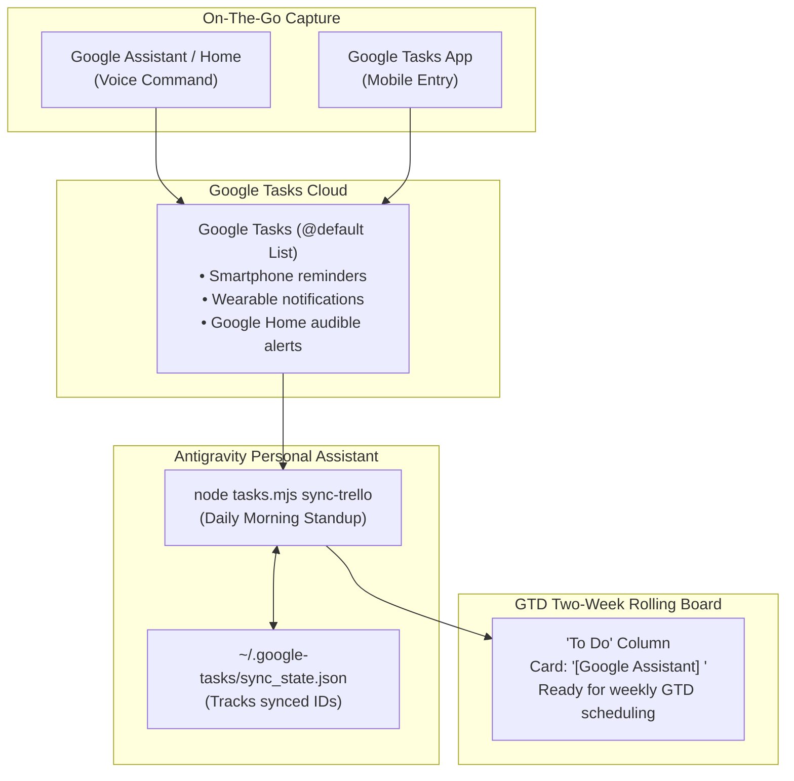

# Google Tasks & Google Assistant Integration

**Status**: Implemented & Operational  
**Cost**: Guaranteed £0.00 (No GCP Billing Account Required)  
**Language Standard**: British English  

---

## 1. Overview & Capture Philosophy

In David Allen's Getting Things Done (GTD) methodology, **ubiquitous capture** is the foundational habit: capturing tasks immediately as they occur so that your mind remains clear and unburdened.

When away from your workstation, **Google Assistant** on smartphones (Android/iOS) and **Google Home** smart speakers provides the fastest, lowest-friction voice capture mechanism available. Saying *"Hey Google, add renew car insurance to my tasks"* instantly writes to your primary Google Tasks list (`@default`).

Our personal assistant bridges Google Tasks directly into your 21-column GTD Two-Week Rolling Trello board.



### Core Operating Principles

1. **One-Way Ingestion**: Uncompleted tasks created in Google Tasks are imported onto the `To Do` column of your GTD board with the prefix `[Google Assistant] <Task Name>`.
2. **Dual-Presence Persistence**: Tasks are **not deleted** from Google Tasks upon ingestion. This is a deliberate design decision: keeping tasks alive in Google Tasks ensures that smartphone lock-screen notifications, Wear OS/Apple Watch alerts, and Google Home spoken reminders continue to trigger as scheduled.
3. **Idempotent Deduplication**: Ingested task IDs are tracked in `~/.google-tasks/sync_state.json`. Repeated sync runs (e.g. during daily standups or ad-hoc reviews) never create duplicate Trello cards.
4. **Dynamic Target Resolution**: The sync engine automatically reads `~/.trello/gtd_board_config.json` (created by `bootstrap-trello-board.py`) to discover the `To Do` list ID. It also supports `process.env.TRELLO_TODO_LIST_ID` or `--target-list-id <id>`.

---

## 2. Architecture Comparison: Why Desktop OAuth?

Upstream Google Workspace MCP implementations (such as `gemini-cli-extensions/workspace`) disable Google Tasks by default because Google's shared public client does not request Tasks scopes. Upstream documentation recommends creating a GCP project, deploying a Cloud Function token-exchange proxy, and configuring Google Secret Manager. That approach requires:
- A billing-enabled GCP account (introducing potential unexpected charges).
- Deploying Gen 2 Cloud Functions and Cloud Build artifacts.
- Managing cloud infrastructure and webhook endpoints.

### Our Solution: Local Desktop Loopback OAuth
Our personal assistant implements a **dedicated local Desktop OAuth 2.0 loopback client** (`localhost:8085`) written in pure Node.js ESM with zero npm dependencies:
- **Guaranteed £0.00 Cost**: No billing account is ever attached to the GCP project. Google Tasks API (`tasks.googleapis.com`) allows up to 50,000 requests per day for free.
- **Zero Cloud Hosting**: Runs entirely on your local machine over stdio and loopback HTTP.
- **No Disruption to Workspace MCP**: Google Calendar and Gmail continue running cleanly via their standard setup.
- **Credential Isolation**: Secrets and tokens reside in `~/.google-tasks/` outside git.

---

## 3. Free GCP Setup Guide (3 Minutes)

Follow these steps to generate your free OAuth 2.0 credentials:

### Step 3.1: Create a Free Project
1. Open the [Google Cloud Console](https://console.cloud.google.com/).
2. Create a new project (e.g. `personal-assistant-tasks`).
3. **Do not attach any billing account.**

### Step 3.2: Enable Google Tasks API
1. Navigate to **APIs & Services > Library**.
2. Search for **Google Tasks API** and click **Enable**.

### Step 3.3: Configure OAuth Consent Screen
1. Go to **APIs & Services > OAuth consent screen**.
2. Select **External** and click **Create**.
3. Set App Name to `Antigravity Tasks` and enter your user support email.
4. In the **Scopes** step, click **Add or Remove Scopes**, filter for `tasks`, and select:
   - `https://www.googleapis.com/auth/tasks`
5. In the **Test Users** step, add your personal Google email address.
6. Save and return to the dashboard.

### Step 3.4: Generate Desktop Client Credentials
1. Navigate to **APIs & Services > Credentials**.
2. Click **Create Credentials > OAuth client ID**.
3. Select **Desktop app** as the Application type.
4. Set the name to `Antigravity Desktop Client` and click **Create**.
5. Download the credentials JSON file.

### Step 3.5: Install Credentials and Authorise
1. Create directory `~/.google-tasks/` if it does not already exist:
   ```powershell
   mkdir ~/.google-tasks
   ```
2. Move your downloaded JSON file to:
   - `~/.google-tasks/client_secret.json`
3. Run the interactive local authorisation command:
   ```powershell
   node .agents/skills/google-tasks/scripts/tasks.mjs auth
   ```
4. Your default browser will open asking you to sign in with your Google account. Click **Continue** (accepting the self-hosted app prompt) and allow Tasks permissions.
5. The local loopback listener records your refresh token in `~/.google-tasks/token.json` and displays an Authorisation Complete confirmation page.

---

## 4. CLI Engine Reference

The CLI engine is located at `.agents/skills/google-tasks/scripts/tasks.mjs`:

```powershell
# Check configuration and token status
node .agents/skills/google-tasks/scripts/tasks.mjs status

# List all task lists
node .agents/skills/google-tasks/scripts/tasks.mjs lists

# List active tasks in the default list
node .agents/skills/google-tasks/scripts/tasks.mjs list

# Create a task
node .agents/skills/google-tasks/scripts/tasks.mjs add --title "Review annual contents insurance" --due 2026-10-01 --notes "Check policy wording"

# Mark a task completed
node .agents/skills/google-tasks/scripts/tasks.mjs complete <task_id>

# Delete a task
node .agents/skills/google-tasks/scripts/tasks.mjs delete <task_id>

# Preview synchronisation into Trello (dry run)
node .agents/skills/google-tasks/scripts/tasks.mjs sync-trello --dry-run

# Execute synchronisation into Trello 'To Do'
node .agents/skills/google-tasks/scripts/tasks.mjs sync-trello
```

---

## 5. MCP Server & Tool Reference

The stdio MCP server is located at `.agents/skills/google-tasks/scripts/mcp_server.mjs`.

When running within Antigravity with the plugin mounted, the assistant has direct access to:

| MCP Tool | Description | Arguments |
| :--- | :--- | :--- |
| `tasks_listLists` | Lists all Google Task lists. | None |
| `tasks_list` | Lists tasks in a specific list. | `listId` (default: `@default`), `showCompleted` (boolean) |
| `tasks_create` | Creates a new task in Google Tasks. | `title` (required), `notes`, `due`, `listId` |
| `tasks_complete` | Marks a task completed. | `taskId` (required), `listId` |
| `tasks_delete` | Permanently deletes a task. | `taskId` (required), `listId` |
| `tasks_syncToTrello` | Ingests new uncompleted tasks into Trello. | `targetListId` (optional), `dryRun` (boolean) |

---

## 6. Morning Standup Automation

The voice capture sync is integrated into your **Daily Morning Standup** CRON routine (`0 7 * * *`).

During the morning review, the assistant:
1. Ingests all new tasks captured via Google Assistant voice commands into Trello's `To Do` column.
2. Cross-references your Google Calendar commitments for the day.
3. Triages urgent emails.
4. Synthesises your prioritized execution plan for the active day.
