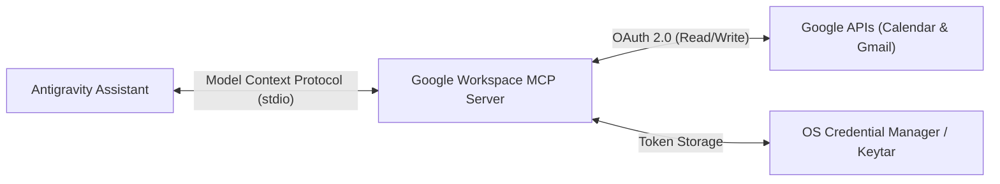

# Google Workspace MCP: Calendar & Gmail Setup Guide

This guide details how to integrate your personal assistant with **Google Calendar** and **Gmail** using the Model Context Protocol (MCP).

---

## 1. Architecture & Security Overview

The assistant communicates directly with Google Workspace using the upstream MCP server from `gemini-cli-extensions/workspace`.



### Security Highlights
- **No Stored Passwords**: Authentication is handled purely via OAuth 2.0.
- **Secure Token Storage**: Refresh tokens are stored directly in your operating system's native secure credential store (Windows Credential Manager, macOS Keychain, or Linux Secret Service via `keytar`).
- **Safety Overrides**: By default, destructive operations are disabled in `.agents/plugins/google-workspace/mcp_config.json`:
  ```json
  "WORKSPACE_FEATURE_OVERRIDES": "gmail.send:off,calendar.deleteEvent:off"
  ```
  This prevents accidental email sending or calendar event deletion without deliberate review.

---

## 2. Quickstart: Agent-Led Setup (Recommended)

Simply open Antigravity and prompt your agent:
> *"Hey Antigravity, set up my Google Workspace integration for Calendar and Gmail."*

Your agent will:
1. Run the automated setup helper script.
2. Clone and build the server locally.
3. Open your browser to complete Google's secure OAuth consent.
4. Verify calendar and email connectivity.

---

## 3. Automated Script Setup

If you prefer running the setup script yourself:

```bash
# From the repository root:
python scripts/setup-workspace-mcp.py
```

The script will automatically:
1. Check that `node` and `npm` are installed.
2. Clone the official `gemini-cli-extensions/workspace` repository into a local tools directory (`tools/google-workspace-mcp`).
3. Install dependencies and compile TypeScript sources (`npm run build`).
4. Generate your active `.agents/plugins/google-workspace/mcp_config.json` with the exact absolute path to `dist/index.js`.
5. Trigger `npm run auth-utils -- login` to open Google OAuth in your default browser.

---

## 4. Manual Setup

If you prefer to configure the server manually:

### Step 1: Clone and Build the Server
```bash
git clone https://github.com/gemini-cli-extensions/workspace.git tools/google-workspace-mcp
cd tools/google-workspace-mcp
npm install
npm run build
```

### Step 2: Authorise with Google OAuth
```bash
npm run auth-utils -- login
```
A browser window will open asking you to sign in with your Google Account and approve permissions for Google Calendar and Gmail.

### Step 3: Configure Antigravity MCP Plugin
Copy `.agents/plugins/google-workspace/mcp_config.example.json` to `.agents/plugins/google-workspace/mcp_config.json` and update the path to point to your built `dist/index.js`:

```json
{
  "mcpServers": {
    "google_workspace": {
      "command": "node",
      "args": [
        "C:\\path\\to\\tools\\google-workspace-mcp\\workspace-server\\dist\\index.js"
      ],
      "env": {
        "WORKSPACE_FEATURE_OVERRIDES": "gmail.send:off,calendar.deleteEvent:off"
      }
    }
  }
}
```

---

## 5. Available Tools

Once configured, your agent has access to the following tools:
* `google_workspace:calendar_listEvents`: Inspect upcoming calendar commitments, meetings, and all-day events.
* `google_workspace:calendar_createEvent`: Add new appointments and milestones.
* `google_workspace:calendar_findFreeTime`: Find open schedule blocks for deep work or meetings.
* `google_workspace:gmail_search`: Query emails using standard Gmail search syntax (`is:unread`, `from:...`).
* `google_workspace:gmail_get`: Fetch email subject, snippet, and body for triage.
* `google_workspace:gmail_createDraft`: Draft outgoing responses for your manual review before sending.
