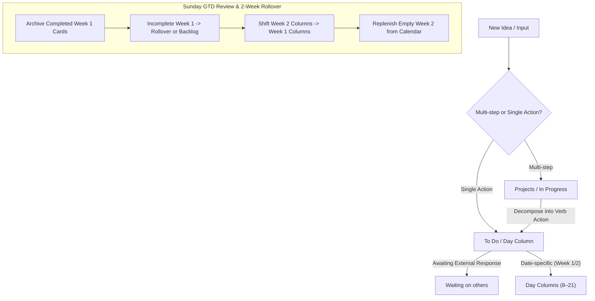

# GTD Two-Week Rolling Planner: Operational Specification & Guide

## 1. Executive Summary & Philosophy

The **GTD Two-Week Rolling Board** serves as your primary operational command centre, task lifecycle engine, and short-term planning horizon. It harmonises David Allen's **Getting Things Done (GTD)** methodology with an explicit **two-week sliding calendar execution window**.

By maintaining an active two-week window alongside standard GTD project and next-action queues, the board provides immediate visibility into date-specific commitments without letting time-independent backlog items get lost.

---

## 2. Core Architecture: The 21-Column System

The board is organised into two continuous zones:
1. **The GTD Project & Action Pipeline** (Columns 1–7): Captures ideas, incubates somedays, catalogues multi-step projects, and holds action backlogs.
2. **The Two-Week Rolling Execution Engine** (Columns 8–21): Two consecutive 7-day calendar weeks (Monday through Sunday) representing the active operational execution window.

### Master Column Directory

| Column # | Column Name | GTD Role | Operational Purpose |
| :---: | :--- | :--- | :--- |
| **1** | **Sometime maybe** | Incubator / Backlog | Ideas, future concepts, non-committed aspirational projects. |
| **2** | **Projects** | Multi-Step Objectives | Master directory of all active and planned multi-step outcomes. |
| **3** | **In Progress Projects** | Active WIP Commitment | WIP-limited focus projects (strict limit: max 10 active). |
| **4** | **On hold** | Paused Projects | Projects temporarily blocked by external prerequisites. |
| **5** | **To Do** | Next Actions Backlog | Actionable physical tasks ready to execute when time allows. |
| **6** | **Waiting on others** | GTD "Waiting For" | Delegations & dependencies: `[Entity] to [Action] (check [Date])`. |
| **7** | **To Do high priority** | Urgent Backlog | Critical or urgent next actions requiring rapid scheduling. |
| **8** | **Monday (Week 1)** | Active Day Execution | Current week - Monday scheduled actions. |
| **9** | **Tuesday (Week 1)** | Active Day Execution | Current week - Tuesday scheduled actions. |
| **10** | **Wednesday (Week 1)** | Active Day Execution | Current week - Wednesday scheduled actions. |
| **11** | **Thursday (Week 1)** | Active Day Execution | Current week - Thursday scheduled actions. |
| **12** | **Friday (Week 1)** | Active Day Execution | Current week - Friday scheduled actions. |
| **13** | **Saturday (Week 1)** | Active Day Execution | Current week - Saturday scheduled actions & household chores. |
| **14** | **Sunday (Week 1)** | Active Day & Review | Current week - Sunday actions & Weekly Review ritual. |
| **15** | **Monday (Week 2)** | Horizon Week | Upcoming week - Monday scheduled actions. |
| **16** | **Tuesday (Week 2)** | Horizon Week | Upcoming week - Tuesday scheduled actions. |
| **17** | **Wednesday (Week 2)** | Horizon Week | Upcoming week - Wednesday scheduled actions. |
| **18** | **Thursday (Week 2)** | Horizon Week | Upcoming week - Thursday scheduled actions. |
| **19** | **Friday (Week 2)** | Horizon Week | Upcoming week - Friday scheduled actions. |
| **20** | **Saturday (Week 2)** | Horizon Week | Upcoming week - Saturday scheduled actions. |
| **21** | **Sunday (Week 2)** | Horizon Week | Upcoming week - Sunday scheduled actions. |

---

## 3. Operational Rules of Motion



### A. Project Decomposition into Next Actions
1. **Projects vs Next Actions**: Cards in `Projects` and `In Progress Projects` represent multi-step objectives (e.g. *Launch Marketing Site*, *Renovate Office*).
2. **Decomposition**: Every active project in `In Progress Projects` must have at least one atomic next physical action generated.
3. **Action Placement**:
   - Time-independent next actions sit in `To Do` (or `To Do high priority` if urgent).
   - Date-specific commitments or scheduled tasks go directly into the target day column in Week 1 or Week 2.

### B. The Two-Week Rolling Cycle
- **Active Week vs Horizon Week**: The first set of 7 days (Lists 8–14) is **always** the active current week. The second set (Lists 15–21) represents the following week ("Horizon Week").
- **Weekly Review & Rollover Ritual** (Executed Sunday evening):
  1. **Audit & Bulk Archive**: Completed cards remain visible on the day columns throughout the week for accountability. During the weekly review, completed cards are archived in bulk.
  2. **Incomplete Task Rollover**: Any tasks remaining incomplete from Week 1 are reviewed. They are either rolled forward to a specific day in the new week, returned to `To Do`, or moved to `Waiting on others`.
  3. **Week 2 Promotion**: All cards scheduled in Week 2 columns roll forward into the corresponding Week 1 column (e.g., Week 2 Monday cards become Week 1 Monday cards).
  4. **Replenish Week 2**: Review upcoming Google Calendar deadlines and active projects, populating new commitments into the newly emptied Week 2 columns.

### C. GTD "Waiting On Others" Convention
- Any task delegated or awaiting an external dependency must be placed in `Waiting on others`.
- Standard title format:
  `[Person/Entity] to [Action] (check [Target Date])`
  *Example:* `Landlord to confirm decorator arrival date (check 24 Oct)`

---

## 4. Semantic Labelling & Context Strategy

To ensure effortless clarity across desktop and mobile without requiring colour decoding:
1. **Self-Describing Titles**: Card titles must be unambiguous and start with a physical action verb (*Call*, *Draft*, *Review*, *Fix*, *Pay*, *Order*).
2. **Context Prefixes in Text**:
   - `[Home]`: Tasks physically bound to the home.
   - `[Call] / [Contact]`: Phone calls or communications.
   - `[Online] / [Admin]`: Screen-based or administrative tasks.
   - `[Finance]`: Invoicing, banking, or payments.
3. **Explicit Time / Appointment Markers**:
   - Prefix appointments directly with the time (e.g. `10:30am Dentist`, `7:30pm Board Game Night`).

---

## 5. Setting Up Your Board

### Option 1: Automated Script Setup (Recommended)
Run the included Trello bootstrapper script:
```bash
python scripts/bootstrap-trello-board.py --name "Personal2Weeks"
```
The script will:
- Authenticate using your credentials in `~/.trello/config.json`.
- Create a new board with all 21 columns in exact GTD order.
- Create standard context labels (`Home`, `Online/Admin`, `Finance`, `Call`, `Waiting`).
- Print and write your new Board ID and List IDs directly into your local configuration.

### Option 2: Guided Setup with Antigravity Agent
Simply ask your agent in chat:
> *"Hey Antigravity, bootstrap my 21-column GTD Trello board."*  
Your agent will run the script, authenticate, and configure the board IDs automatically!

### Option 3: Manual UI Setup
1. Log into [Trello](https://trello.com) and click **Create Board**.
2. Name the board `Personal2Weeks` (or your preferred name).
3. Create the 21 columns exactly in the order listed in the **Master Column Directory** above.
4. Note your Board ID from the browser URL (`https://trello.com/b/<BOARD_ID>/board-name`).
