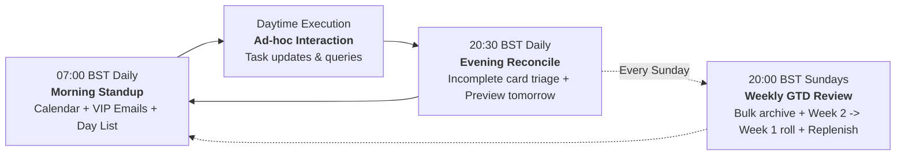

# Antigravity Scheduled Tasks: CRON Automation Guide

This guide details how to configure autonomous background automation for your personal assistant using **Antigravity's native Scheduled Tasks**.

---

## Overview of Assistant CRON Cadences

Your personal assistant operates on three core automated rhythms:



---

## Configuring Scheduled Tasks in Antigravity

Scheduled Tasks run autonomously in the background inside your Antigravity Desktop App, triggering conversations at specified CRON intervals.

### Step-by-Step Setup
1. Open the **Antigravity Desktop Application**.
2. In the left-hand sidebar, click **Scheduled Tasks** (alarm clock icon).
3. Click **+ New Task** in the top-right corner.
4. Fill in the **Task Name**, **Cron Expression**, **Target Workspace**, and paste the **Prompt** from the templates below.
5. Click **Save Task**.

---

## Task Templates & Prompts

### 1. Daily Morning Standup

* **Task Name**: `PersonalAssistant-MorningStandup`
* **Cron Expression**: `0 7 * * *` (07:00 Local Time Daily)
* **Target Workspace**: Select your local repository root.
* **Prompt**:
```text
Execute the 07:00 Daily Standup following GEMINI.md and the personal-assistant skill:
1. Ground yourself by reading docs/personal-context.md and docs/glossary.md.
2. Ingest today's Google Calendar events using the google_workspace MCP server.
3. Ingest unread VIP correspondence from Gmail (matching key clients, employers, schools, or family members).
4. Inspect today's day column on your GTD Trello board.
5. Cross-reference hard calendar commitments against scheduled Trello tasks to detect any conflicts.
6. If any scheduling conflict, ambiguous task, or urgent item requires a decision, prompt me using the ask_question tool with structured, mobile-friendly multiple-choice options.
7. Deliver a crisp, executive morning briefing organised by: What, When, Where, and How.
```

---

### 2. Daily Evening Reconcile

* **Task Name**: `PersonalAssistant-EveningReconcile`
* **Cron Expression**: `30 20 * * *` (20:30 Local Time Daily)
* **Target Workspace**: Select your local repository root.
* **Prompt**:
```text
Execute the 20:30 Evening Reconcile following GEMINI.md and the personal-assistant skill:
1. Read docs/personal-context.md.
2. Inspect today's day list on your GTD Trello board.
3. Identify all incomplete cards on today's list.
4. For each incomplete card, prompt me with a rapid multiple-choice question via ask_question:
   - Move to tomorrow
   - Schedule later this week
   - Return to To Do backlog
   - Archive / drop
5. Execute confirmed choices on Trello immediately.
6. Preview tomorrow morning's calendar schedule, school/commute logistics, and early commitments.
```

---

### 3. Sunday GTD Weekly Review & 2-Week Rollover

* **Task Name**: `PersonalAssistant-SundayWeeklyReview`
* **Cron Expression**: `0 20 * * 0` (20:00 Local Time Sundays)
* **Target Workspace**: Select your local repository root.
* **Prompt**:
```text
Execute the Sunday Weekly GTD Review & 2-Week Rollover following GEMINI.md and the personal-assistant skill:
1. Read docs/personal-context.md and docs/glossary.md.
2. Connect to the GTD Trello board:
   a. Bulk archive all completed cards across Week 1 (Monday to Sunday).
   b. Execute the 2-Week Rolling shift: move all cards in Week 2 day columns forward into the corresponding Week 1 day columns.
   c. Scan Google Calendar for the upcoming 7–14 days and populate date-specific commitments into the newly emptied Week 2 columns.
   d. Audit 'Waiting on others' for check dates due this upcoming week or items >30 days old.
   e. Identify active projects in 'In Progress Projects' lacking next physical actions.
3. Present me with 2-3 mobile-optimised multiple-choice prompts via ask_question for any unfinished Week 1 rollover decisions or proposed new project actions.
4. Execute confirmed updates on Trello and update docs/personal-context.md.
```

---

## Agent-Assisted Configuration

You don't need to manually configure these prompts! Simply ask your Antigravity agent:
> *"Hey Antigravity, guide me through setting up my scheduled morning standup, evening reconcile, and Sunday review."*

The agent will read your configured board name and personalised profile, tailor each prompt with your exact details, and guide you through adding them to your Antigravity sidebar.
